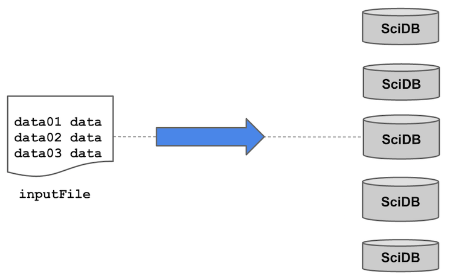
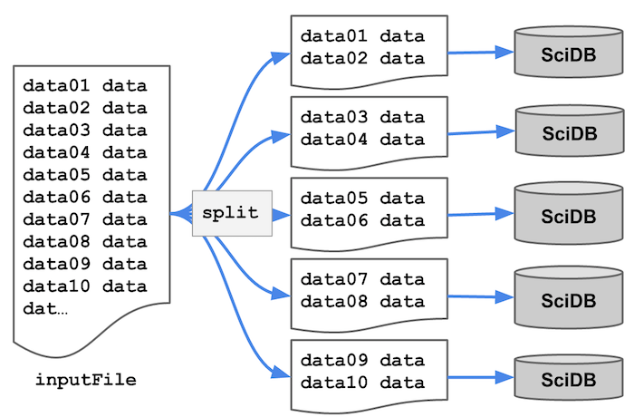

## Recap: PDQ requirements

- Parallel load
- R interface (`getSeries`)
- Elastic compute (`foreach`)

## Data file

Let's work with CSV
```{r}
cat(system("head /home/scidb/trades_", intern=TRUE),sep="\n")
```

## ScDBR library

```{r}
library(scidb)
scidbconnect()
```

## Loading data



## Non-parallel load

```{r}
data = iquery("input(<symbol:string, price:double, volume:int32> 
                        [i=0:*,10,0], 
                  '/home/scidb/trades_', 
                  -2, 
                  'csv')", 
         return=TRUE)
print(head(data))
```

## Parallel load



## Parallel load

```{r}
data = iquery("input(<symbol:string, price:double, volume:int32> 
                        [i=0:*,10,0], 
                  'trades_', 
                  -1, 
                  'csv')", 
         return=TRUE)
print(head(data))
```

## Simple look ups

```{r, echo=FALSE}
ticker_index = function(ticker)
{
  x = iquery("tkr", return=TRUE)
  tkrs = x[, 1]
  names(tkrs) = x[, 2]

  ans = tkrs[ticker]
  if(any(is.na(ans)))
  {
    stop("unknown symbol(s): ", paste(ticker[is.na(ans)]))
  }
  ans
}
```
Look up ticker indices:
```{r}
ticker_index(c("AAPL", "ABG"))
```
## Download trades

```{r, echo=FALSE}
get_series_internal = function(taq_array, date, ticker, type, ticker_name)
{
  THRESH_K=3    # the threshold for choosing between `cross_between` and `cross_join`
  # if number of sets of contiguous tickers <= THRESH_K, then use `cross_between`
  #exchanges = iquery("exchanges", return=TRUE)
  #sources   = iquery("sources",   return=TRUE)
  NAMES = scidb_attributes(scidb(taq_array))
  taq = scidb(taq_array)
  chunks = scidb_coordinate_chunksize(taq)
  names(chunks) = dimensions(taq)
  
  # Code to generate a cross_between query	
  rn_lo=0             # lower bound: rownumbers are designed to be positive
  rn_hi=1000000000    # upper bound: set heuristically at 10 Billion
  sorted=sort(ticker)
  breaks=c(0, which(diff(sorted)!=1), length(sorted))
  if (length(breaks) == 2) # completely contiguous set of tickers; use `between`
  {
    query =sprintf("between(%s, null, %d, null, null, %d, null)", taq_array, sorted[1], sorted[length(sorted)])
  } 
  else if (length(breaks) >2 & length(breaks) <= THRESH_K + 2) # few sets of contiguous tickers; use `cross_between`
  {
    cb_pts =  paste( sapply(seq(length(breaks)-1), function(i) sprintf("(0, %d, 0, 0, %d, 1000000000)", sorted[breaks[i]+1], sorted[breaks[i+1]])), collapse=" , ")
    rt_array=sprintf("build(<dateLo:int64, tickerLo: int64, tmLo: int64, dateHi: int64, tickerHi: int64, tmHi: int64>[idx=1:%d,100000,0],'{1}[%s]',true)", length(breaks)-1, cb_pts)
    query=sprintf("cross_between(project(%s, price, volume, exchange), %s)", taq_array, rt_array)
  }
  else # mostly non-contiguous tickers, use `cross_join`
  {
    # Formulate the cross_join query
    query=sprintf("project(cross_join(%s as A, redimension(build(<date:int64,ticker_index:int64>[idx=1:%d,100000,0],'{1}[%s)]',true), <idx:int64>[date=0:*,%s,0,ticker_index=0:*,%s,0]) as B, A.date, B.date, A.ticker_index, B.ticker_index), %s)", taq_array, length(ticker),  paste(sprintf("(%s", date), ticker, sep=",", collapse="),"), chunks["date"], chunks["ticker_index"], paste(NAMES, collapse=","))
  }
  
  series = iquery(query, return=TRUE)
  
  return(series)
}

getSeries = function(date="2013-12-18", ticker="ABG", cache=FALSE, from_array_prefix="trades_")
{
  if(length(date) > 1) stop("getSeries only supports one date at a time. Consider using lapply.")
  if("Date" %in% class(date) || "POSIXct" %in% class(date)) date = format(date,"%Y%m%d")
  else if(grepl("-", date)) date = format(as.Date(date),"%Y%m%d")
  lookup_ticker = ticker
  lookup_date = as.integer(date)
  from_array = sprintf("%s%.0f", from_array_prefix, lookup_date)

  ans = NULL

  lookup_ticker_index = ticker_index(ticker)
  # obtain remainder from SciDB
  noncached = get_series_internal(from_array, lookup_date, lookup_ticker_index, "all", lookup_ticker)
  if(is.null(ans) || all(!cached)) return(noncached)
  if(is.data.frame(noncached)) noncached = list(noncached)
  ans[!cached] = noncached
  ans
}
```

Now access the trades for these tickers

```{r}
x = getSeries("20131218", c("AAPL", "ABG"))
head(x)
```

## Three cases

Single ticker:
```{r, eval=FALSE}
getSeries("20131218", "AAPL")
```

Random tickers:
```{r, eval=FALSE}
getSeries("20131218", c("AAPL", "QQQ", ...))
```

Adjacent tickers:
```{r, eval=FALSE}
getSeries("20131218", c("AAON", "AAP", "AAPL"))
```

